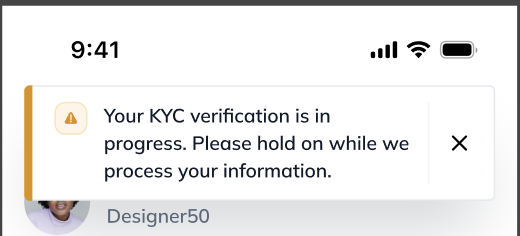
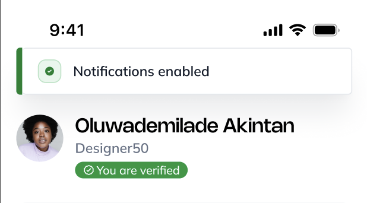

# React Native Toast Message Reanimated

A reusable toast library for React Native built around `react-native-reanimated`, `react-native-gesture-handler`, and `react-native-safe-area-context`.

## Features

- Reanimated toast stack with swipe-to-dismiss
- Queueing with configurable `maxVisible`
- Imperative API and hook API
- Named hosts with optional extra `ToastViewport` instances
- Default layout plus full custom renderers
- Slot-based style overrides for the default layout
- Typography that inherits the app's default font unless you override it

## Preview

| Info | Success |
| --- | --- |
|  |  |

## Installation

Install the peer dependencies in your app:

```bash
npm install react-native-gesture-handler react-native-reanimated react-native-safe-area-context
```

Then add this library to your project and make sure your app already follows the standard setup for Reanimated and Gesture Handler.

## Quick Start

```tsx
import React from 'react';
import { Button, View } from 'react-native';
import { Toast, ToastProvider, useToast } from '@emekauja/react-native-toast-message';

const DemoButton = () => {
  const toast = useToast();

  return (
    <Button
      title='Show toast'
      onPress={() =>
        toast.show({
          title: 'Saved successfully',
          subtitle: 'Your changes are already synced.',
          type: 'success'
        })
      }
    />
  );
};

export default function App() {
  return (
    <ToastProvider>
      <View>
        <DemoButton />
        <Button
          title='Show global toast'
          onPress={() =>
            Toast.show({
              title: 'Sent',
              type: 'info'
            })
          }
        />
      </View>
    </ToastProvider>
  );
}
```

## Public API

### `ToastProvider`

Mounts the default toast host and provides the hook/imperative API bridge.

Props:

- `layouts`: register named custom layouts
- `defaultLayout`: choose the fallback layout key
- `defaultOptions`: default toast options merged before each toast
- `iconByTone`: override the default layout icons for any tone and the close `x`
- `showToneIcons`: hide or show the default layout tone icons globally
- `maxVisible`: number of simultaneously visible toasts per host
- `offsets`: top/bottom edge offsets
- `theme`: toast theme overrides, including typography slots
- `renderDefaultViewport`: disable the automatic default host if you want to mount all viewports manually
- `viewportProps`: props forwarded to the automatic default viewport

### `useToast()`

Returns:

- `show(options)`
- `hide(id)`
- `hideAll(host?)`

### `Toast`

Imperative singleton with the same methods as `useToast()`:

```ts
Toast.show(options);
Toast.hide(id);
Toast.hideAll();
Toast.hideAll('modal');
```

### `ToastViewport`

Manually renders a named host. This is primarily useful inside modals or if you disable the default viewport.

Props:

- `host`
- `maxVisible`
- `offsets`
- `defaultOptions`
- `style`

## Toast Options

```ts
type ToastOptions = {
  id?: string;
  title: React.ReactNode;
  subtitle?: React.ReactNode;
  type?: 'default' | 'success' | 'error' | 'warning' | 'info';
  placement?: 'top' | 'bottom';
  duration?: number;
  autoHide?: boolean;
  host?: string;
  leading?: React.ReactNode;
  trailing?: React.ReactNode;
  action?: {
    label: string;
    onPress: () => void;
    closeOnPress?: boolean;
  };
  layout?: string;
  render?: (props: ToastLayoutRenderProps) => React.ReactNode;
  styles?: ToastStyleOverrides;
};
```

`Toast.show()` returns the toast id.

## Typography and Font Behavior

The default layout does not bundle or load fonts. It uses normal React Native text styles and therefore inherits the consuming app's default font behavior.

If your app uses a custom family globally, the toast will follow that. If you want toast-specific typography, pass theme overrides:

```tsx
<ToastProvider
  theme={{
    typography: {
      title: { fontFamily: 'YourApp-Semibold' },
      subtitle: { fontFamily: 'YourApp-Regular' },
      action: { fontFamily: 'YourApp-Semibold' }
    }
  }}
/>
```

If no `fontFamily` is supplied, React Native falls back to the native/system font on that platform.

## Custom Layouts and Styles

Register named layouts:

```tsx
<ToastProvider
  layouts={{
    banner: ({ toast, dismiss, tone }) => (
      <Pressable onPress={dismiss} style={{ backgroundColor: tone.background, padding: 16 }}>
        <Text>{toast.title}</Text>
      </Pressable>
    )
  }}
/>
```

Use the layout:

```tsx
Toast.show({
  title: 'Server updated',
  layout: 'banner'
});
```

Or override one toast inline:

```tsx
Toast.show({
  title: 'Inline custom toast',
  render: ({ toast, dismiss }) => (
    <Pressable onPress={dismiss}>
      <Text>{toast.title}</Text>
    </Pressable>
  )
});
```

Slot-based styling is available for the default layout:

```tsx
Toast.show({
  title: 'Styled toast',
  styles: {
    container: { backgroundColor: '#111827' },
    title: { color: '#ffffff' },
    subtitle: { color: '#d1d5db' }
  }
});
```

You can also replace or suppress the default layout icons from the provider:

```tsx
import { CheckCircle, TriangleAlert, X } from 'lucide-react-native';

<ToastProvider
  iconByTone={{
    success: CheckCircle,
    error: CheckCircle,
    warning: TriangleAlert,
    info: CheckCircle,
    x: X
  }}
/>
```

To hide the leading tone icons entirely while keeping the close button:

```tsx
<ToastProvider showToneIcons={false} />
```

See [API docs](./docs/api.md), [custom layouts](./docs/custom-layouts.md), and [modal usage](./docs/modal-usage.md).
